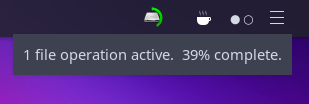

# Carbon-Tray-Applet
Budgie Applet that displays GtkStatusIcon (xembed) icons

Original source from github.com/buddiesofbudgie/budgie-desktop forked at v10.7.2

## Dependencies

- meson (>=0.60)
- ninja
- libpeas-1.0
- libpeas-gtk-1.0
- x11
- gdk-x11-3.0
- gtk+-3.0
- gnome
- intltool-merge
- i18n
- budgie-1.0